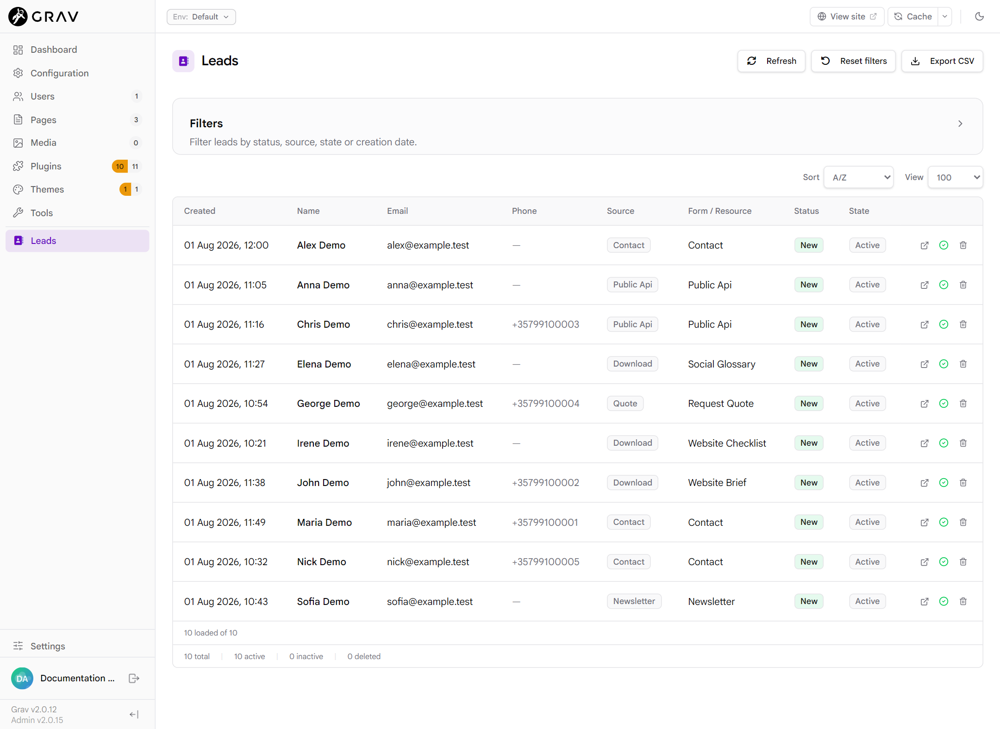

# Goosialize Leads

[](https://getgrav.org/)
[](https://github.com/goosialize/goosialize-leads/releases)
[](LICENSE)
[](https://github.com/getgrav/grav/issues/4238)

Goosialize Leads captures enquiries from Grav Forms and compatible
integrations, stores them safely, and gives administrators a native Admin2
workspace for reviewing, managing and exporting Leads. It is independent of
the active frontend theme.

See [GitHub Releases](https://github.com/goosialize/goosialize-leads/releases)
for the latest stable version and release package.

**Grav GPM status:** version 1.0.3 is approved and pending the next catalogue
update. Until it appears in your configured catalogue, use the stable GitHub
release package.

## Compatibility and dependencies

- Grav CMS `>=2.0.12`
- PHP `>=8.3` with `ext-intl`
- Grav API plugin
- Grav Admin2 plugin
- Grav Email plugin

The native Grav Form plugin is also needed when capturing Leads from Grav
Forms. API, Admin2 and Email are declared package dependencies. Email delivery
remains optional until notifications are enabled.

## Install

When Goosialize Leads is available in your configured GPM catalogue, install
it from the Grav root:

```bash
php bin/gpm install goosialize-leads
```

Alternatively, download a stable `goosialize-leads-<version>.zip` from
[GitHub Releases](https://github.com/goosialize/goosialize-leads/releases)
and install it directly:

```bash
php bin/gpm direct-install -y /absolute/path/goosialize-leads-<version>.zip
```

The installed plugin folder is `user/plugins/goosialize-leads`. See the
[Installation guide](docs/INSTALLATION.md) for dependency and clean-install
checks.

## Capture your first Lead

The quickest supported route is a native Grav Form:

1. Open **Plugins > Goosialize Leads** in Admin2.
2. On the **Forms** tab, enable Forms capture and select your form.
3. Add `goosialize_leads_capture: true` to the form's `process` section.
4. Submit the form, then open **Leads** in the Admin2 sidebar.

The [Quick Start](docs/QUICK_START.md) contains a complete copy/paste form and
the expected result.

## Admin2 overview

The **Leads** workspace provides Search; Status, Source, State and
Form / Resource filters; Created from/to filters; sorting; page-size controls;
inline editing; Active/Inactive workflow; reversible Delete and Restore; and
CSV Export when enabled.

The backend collection is deliberately bounded to the latest 100 Lead records.
The [Admin Guide](docs/ADMIN_GUIDE.md) explains the workspace in plain
language, including what **View: All** means.



*The native Admin2 workspace with synthetic Leads, bounded table controls,
row actions and footer totals.*

## Core features

- Theme-independent native Grav Forms capture.
- Canonical Lead storage with immutable primary records.
- Permission-aware Admin2 management using separate workflow metadata.
- Search and filters over a bounded latest-100 collection.
- Inline status and Active/Inactive management.
- Reversible Delete and Restore.
- Bounded CSV Export with spreadsheet-formula protection.
- Lead data retention across plugin upgrades and ordinary package removal.

## Advanced integrations

Optional advanced facilities include:

- a public, anonymous JSON capture endpoint protected by an exact Origin
  allowlist, idempotency, rate limiting and a configured key ring;
- a versioned PHP capability for compatible local Grav plugins;
- a durable notification outbox and Grav Email delivery;
- scheduled delivery, bounded Retries, Dead letter state and revision-safe
  operator reconciliation.

These facilities are disabled by default and must be configured explicitly.

## Documentation

### Recommended reading order

1. [Quick Start](docs/QUICK_START.md)
2. [Installation](docs/INSTALLATION.md)
3. [Admin Guide](docs/ADMIN_GUIDE.md)
4. [Grav Forms integration](docs/FORMS_INTEGRATION.md)
5. [CSV Export](docs/CSV_EXPORT.md)
6. [FAQ](docs/FAQ.md)
7. [Configuration](docs/CONFIGURATION.md)
8. [Permissions](docs/PERMISSIONS.md)
9. [Security](docs/SECURITY.md)
10. [Public JSON API](docs/JSON_API_INTEGRATION.md)
11. [Notification delivery](docs/NOTIFICATION_DELIVERY.md)
12. [Operational status](docs/OPERATIONAL_STATUS.md)
13. [Troubleshooting](docs/TROUBLESHOOTING.md)

### Advanced operations and integration

- [Scheduler](docs/SCHEDULER.md)
- [Retry and Dead Letter](docs/RETRY_DEAD_LETTER.md)
- [Reconciliation](docs/RECONCILIATION.md)
- [CLI reference](docs/CLI_REFERENCE.md)
- [Public plugin integration contract](docs/PUBLIC_INTEGRATION_CONTRACT.md)
- [Examples](docs/EXAMPLES.md)
- [Upgrade](docs/UPGRADE.md)
- [Uninstall and data retention](docs/UNINSTALL_DATA_RETENTION.md)

### Reference

- [Changelog](CHANGELOG.md)
- [1.0.3 release notes](docs/RELEASE_NOTES_1.0.3.md)
- [Earlier release notes](docs/RELEASE_NOTES_1.0.2.md)
- [Admin2 Lead index technical reference](docs/ADMIN2_LEAD_INDEX.md)

## Security and data summary

Captured primary Lead records are immutable. Admin2 changes write only
validated metadata for status, lifecycle state and optimistic revision.
**Delete is reversible** and does not erase the primary record; Restore is the
only mutation allowed while a Lead is deleted.

Every private Admin2/API operation enforces its own server-side permission.
Secrets are password-protected and redacted from configuration responses.
Runtime Lead and notification data stays under
`user/data/goosialize-leads/v1` and is not automatically removed with the
plugin package.

Read [Security](docs/SECURITY.md), [Permissions](docs/PERMISSIONS.md) and the
[FAQ](docs/FAQ.md) before enabling public capture or notification delivery.

## Development and technical reference

The deterministic package manifest is `packaging/package-files.txt` and the
package builder is `scripts/build-plugin-package.sh`. Development tests and
release acceptance material remain outside the installable package.

The public plugin-to-plugin contract is
[`docs/PUBLIC_INTEGRATION_CONTRACT.md`](docs/PUBLIC_INTEGRATION_CONTRACT.md).
Contributors should also consult the repository development instructions and
the development-only architecture, verification and acceptance documents.

## Support and feedback

For installation problems and reproducible bugs, first review the documentation and troubleshooting notes, then use the structured feedback channels:

- [Report a bug](https://github.com/goosialize/goosialize-leads/issues/new?template=bug_report.yml)
- [Request a feature](https://github.com/goosialize/goosialize-leads/issues/new?template=feature_request.yml)
- [Support and feedback guide](SUPPORT.md)

Please do not post passwords, API keys, access tokens, personal data, customer data, private production URLs, or security-sensitive exploit details in a public issue.
