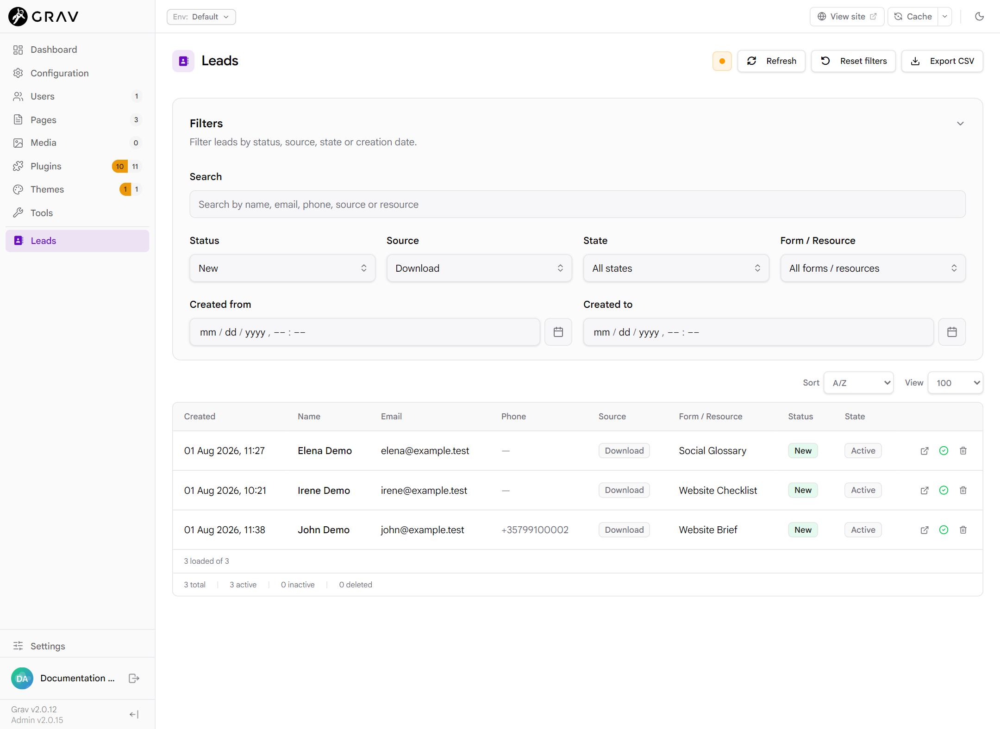
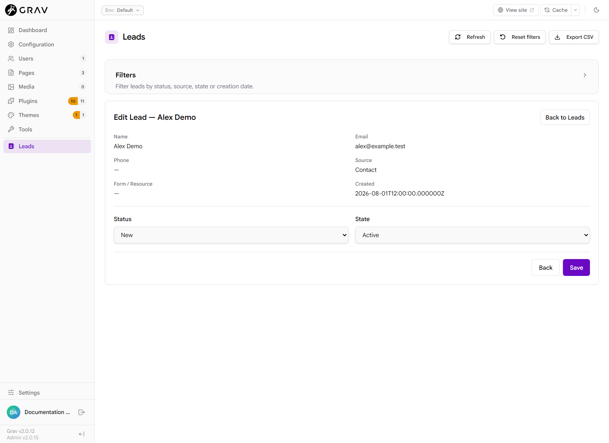
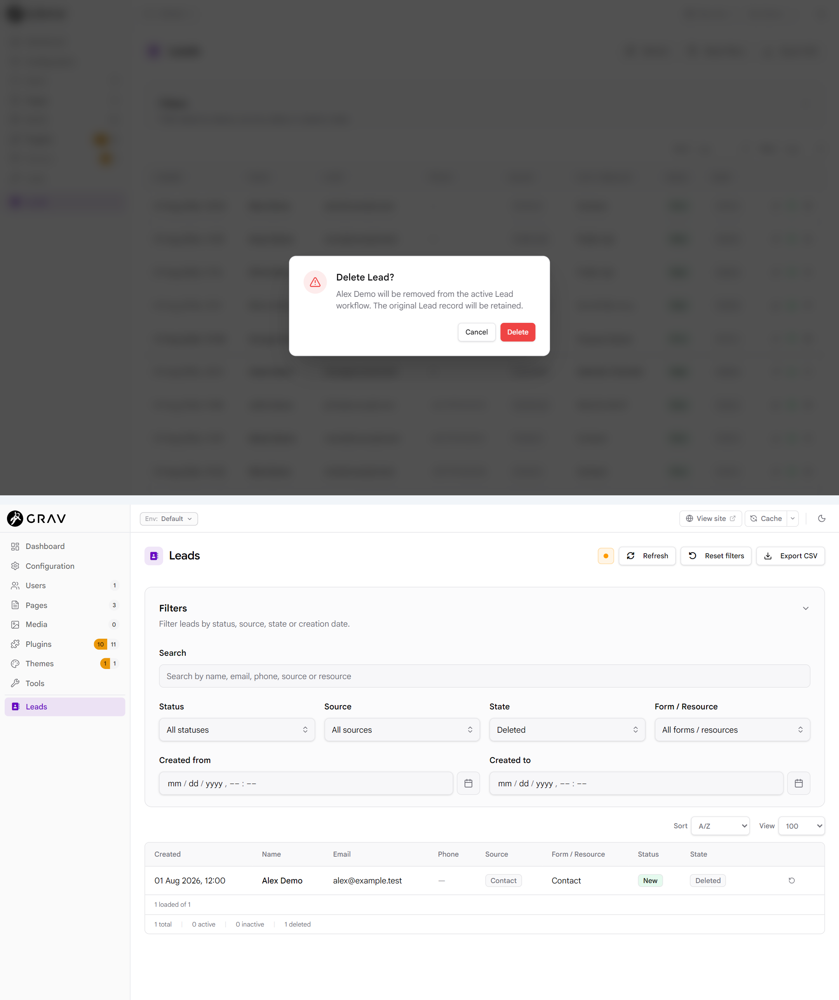
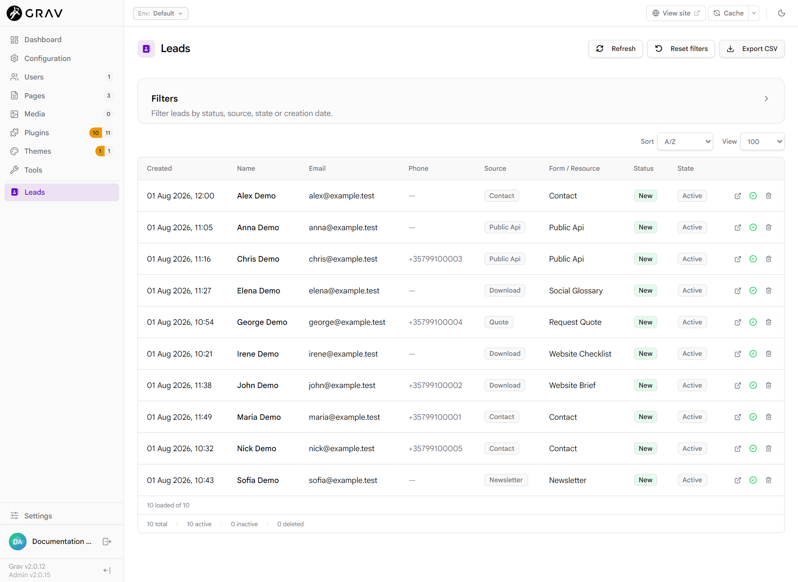

# Admin Guide

This is the normal administrator guide to the Goosialize Leads workspace. For
implementation and storage details, see the
[Admin2 Lead index technical reference](ADMIN2_LEAD_INDEX.md).

> **Audience:** Administrators who review and manage Leads in Admin2.

## Open the Leads workspace

Sign in to Admin2 and select **Leads** in the main sidebar. The item is visible
when the plugin and Lead index are enabled and the user has
`api.goosialize_leads.read`.

If the menu is missing, see [Troubleshooting](TROUBLESHOOTING.md#leads-menu-is-missing)
and [Permissions](PERMISSIONS.md).

## Find Leads

Open **Filters** to use the native filter fields:

- **Search** matches name, email, phone, source or resource text.
- **Status** filters the administrator workflow status.
- **Source** filters the capture channel, such as `website`, `newsletter` or
  `public_api`.
- **State** filters Active, Inactive or Deleted Leads.
- **Form / Resource** filters the native form name or integration resource.
- **Created from** includes Leads created at or after the selected datetime.
- **Created to** includes Leads created at or before the selected datetime.

Source and Form / Resource choices come from distinct non-empty values in the
bounded collection currently loaded by the workspace. Clear or reset filters
if a combination returns no rows. Filters combine: a row must satisfy every
active field.

*Status `New` and Source `Download` are combined here, reducing the synthetic
bounded collection to three matching Leads.*

## Sort, View and pagination

**Sort** orders the filtered loaded collection by creation time or Lead name.
**View** selects 10, 20, 30, 50, 100 or All rows per page. Pagination appears
below the table only when the filtered result has more than one page.

The backend intentionally loads no more than the latest 100 validated primary
Lead records. **View: All** therefore means all filtered rows in that loaded
collection, not all historical Lead data. Changing View or moving between
pages never widens the latest-100 boundary.

## Understand the table

Each row shows Created, Name, Email, Phone, Source, Form / Resource, Status and
State information, followed by the controls permitted for your account.

The footer reports:

- how many records were loaded and how many match the current filters;
- the filtered total;
- filtered Active, Inactive and Deleted counts.

## Open and edit a Lead

With write permission, select the Lead name or **Edit** action to open the
inline editor. The editor shows identity and capture context and allows Status
and State changes. Saving returns to the same workspace.

If another administrator changed the same Lead after you opened it, your save
is rejected as a revision conflict rather than overwriting their work. Reload
the workspace, review the current values and apply the change again if it is
still appropriate.

Captured primary data remains immutable. Admin changes affect only validated
workflow metadata; see [Security](SECURITY.md).

*The inline editor exposes non-sensitive capture context and keeps Status
separate from State.*

## Status and Active/Inactive

**Status** describes where the Lead sits in the administrator workflow.
**State** controls its lifecycle visibility:

- **Active** is the normal working state.
- **Inactive** retains the Lead but marks it inactive.
- **Deleted** is a reversible administrative state.

Write permission allows Status changes, inline Edit, Active/Inactive changes
and Restore.

## Delete and Restore

Delete requires its separate permission and a confirmation. It does not erase
the captured primary record. A deleted Lead cannot be edited, deleted again,
set Active/Inactive or have its Status changed.

Restore is the only allowed change for a deleted Lead. It requires write
permission, returns the Lead to Active, and preserves the Lead's Status.

> **Delete is reversible.** It records a Deleted metadata State and retains
> the immutable primary Lead record.

*Two real Admin2 states: the confirmation explains retention; the Deleted
filter exposes the Restore action.*

## Export CSV

When CSV Export is enabled and the user has both read and export permissions,
the **Export CSV** page action is available. Export uses the same bounded Lead
collection as the workspace and is not changed by the current View selection
or client-side page.

See [CSV Export](CSV_EXPORT.md) for the filename, size bound and spreadsheet
safety rules.

*Export CSV downloads a server-named file such as
`goosialize-leads-YYYY-MM-DD-HHmm.csv`.*

## Permission-dependent controls

- `api.goosialize_leads.read`: open and filter the workspace.
- `api.goosialize_leads.write`: Edit, Status, Active/Inactive and Restore.
- `api.goosialize_leads.delete`: reversible Delete.
- `api.goosialize_leads.export`: CSV Export when combined with read.

Controls that the user cannot execute are omitted. The API also checks every
permission server-side; hiding a control is not the security boundary. See
[Permissions](PERMISSIONS.md).

For common symptoms, read [Troubleshooting](TROUBLESHOOTING.md) and the
[FAQ](FAQ.md).

---

## Navigation

[← Back to README](../README.md) · [Previous: Installation](INSTALLATION.md) ·
[Next: Grav Forms integration →](FORMS_INTEGRATION.md)

Related documentation: [CSV Export](CSV_EXPORT.md) ·
[Permissions](PERMISSIONS.md) · [Troubleshooting](TROUBLESHOOTING.md)
