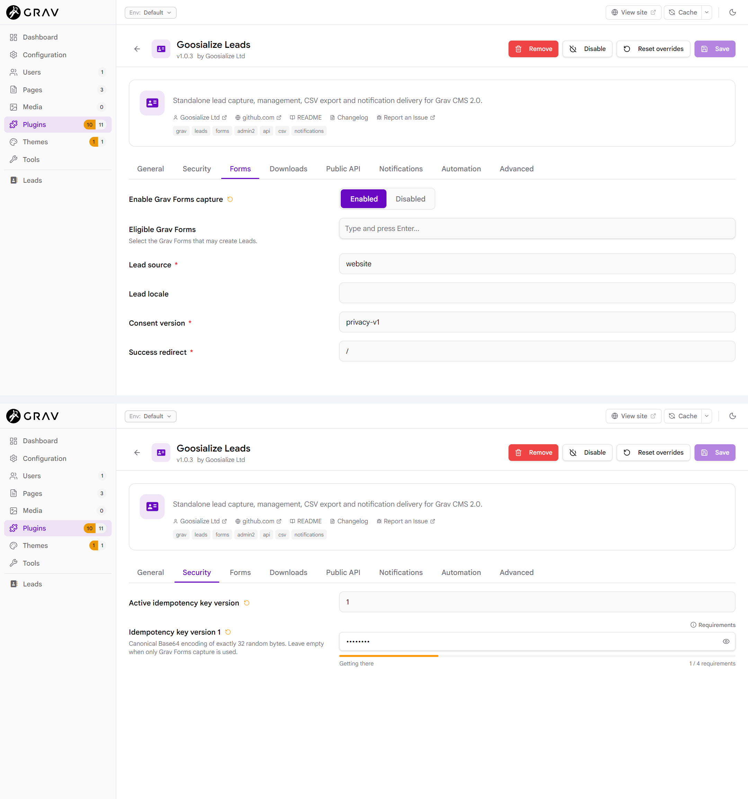

# Configuration

The canonical configuration file is:

```text
user/config/plugins/goosialize-leads.yaml
```

Settings can be managed from **Plugins > Goosialize Leads** in Admin2 or in
that YAML file. Start with [Quick Start](QUICK_START.md) for the smallest
working Forms setup.

> **Audience:** Administrators configuring supported capture and delivery
> features. Treat key-ring and mail-routing values as security-sensitive.

## Basic

### Plugin and Admin2 index

```yaml
enabled: true
admin2_index:
  enabled: true
  timezone: UTC
```

Both the plugin and Admin2 Lead index are enabled in the shipped defaults.
Disabling the plugin makes all integrations inert. Disabling the index removes
the Leads workspace. The index timezone is fixed at UTC and the backend load
is bounded to the latest 100 validated primary records.

Workspace access also requires `api.goosialize_leads.read`; see
[Permissions](PERMISSIONS.md).

### Grav Forms

```yaml
forms:
  enabled: false
  forms: []
  source: website
  locale: null
  consent_version: privacy-v1
  success_redirect: /
```

- `forms` is the explicit allowlist of native Grav form names. In Admin2,
  select from discovered forms.
- `source` becomes the stored Lead Source. It is a lowercase slug using
  letters, digits, `_` or `-`, up to 64 characters.
- `locale` is optional. Use a valid locale such as `en` or `en_GB`, or leave it
  `null`.
- `consent_version` records the privacy/consent text version accepted by the
  visitor. It is a required lowercase slug.
- `success_redirect` must be a local absolute path beginning with one `/`,
  such as `/thank-you`. URLs, query strings, fragments, backslashes, `//`, and
  `.` or `..` path segments are rejected.

Only allowlisted forms using the exact `goosialize_leads_capture` process
action are eligible. XHR Forms submission is not supported. See
[Forms integration](FORMS_INTEGRATION.md).

### CSV Export

```yaml
admin2_csv_export:
  enabled: false
  max_response_bytes: 131072
```

The response bound is fixed at 131,072 bytes. Export also requires both read
and export permissions. See [CSV Export](CSV_EXPORT.md).

## Advanced

### Downloads integration

```yaml
downloads:
  enabled: false
  rules: []
```

Downloads rules map a compatible provider's resource identifier to a native
capture form and trusted Lead source:

```yaml
downloads:
  enabled: true
  rules:
    - resource_id: product-guide
      form: download-request
      source: download
```

Goosialize Leads does not serve files. A compatible download/resource plugin
uses the version 1 public capture capability and supplies the configured
resource context. `resource_id` and `source` are bounded lowercase slugs; the
form must identify the intended native capture form.

### Public JSON API

```yaml
public_api:
  enabled: false
  allowed_origins: []
  locale: null
  consent_version: privacy-v1
  body_max_bytes: 16384
  json_max_depth: 4
  rate_limit_count: 10
  rate_limit_window_seconds: 60
```

Origins must be exact canonical `http` or `https` origins. Wildcards, paths,
credentials, queries and fragments are not accepted. Public JSON API locale uses a
hyphenated form such as `en-GB` when specified.

The endpoint suffix is `/goosialize-leads/capture`. Its base is derived from
the API plugin's `route` and `version_prefix` settings. With the default API
configuration the full path is `/api/v1/goosialize-leads/capture`; a custom
API base produces a different path. See [Public JSON API](JSON_API_INTEGRATION.md).

The size, depth and rate-limit values above are fixed security bounds in the
current contract.

## Security

### Idempotency key ring

```yaml
idempotency:
  active_key_version: null
  keys: {}
```

`active_key_version` selects the positive integer key version used for keyed
capture. Each secret uses the canonical nested shape:

```yaml
idempotency:
  active_key_version: 1
  keys:
    1:
      secret: <canonical-base64-secret>
```

The secret is canonical Base64 encoding of exactly 32 random bytes. It must
not be committed, logged, packaged or included in support material.

Admin2 exposes the version 1 secret as a password field. The API configuration
response redacts every nested `secret` value. A blank or masked field does not
prove that no secret is stored; do not replace it casually.

Trusted Grav Forms capture accepts the shipped empty key ring. In keyless
Forms mode, no keyed idempotency digest is stored. The public JSON endpoint and
public plugin capability remain unavailable until a valid active version and
matching secret are configured.

### Legacy secret migration

On upgrade, the plugin rewrites legacy scalar entries such as:

```yaml
keys:
  1: <secret>
```

to `keys.1.secret` in the base plugin configuration and existing environment
overrides. The secret bytes and active version are preserved exactly; no key
is generated or rotated. The migration is idempotent. If the PHP/web user
cannot persist the secure form, the plugin blocks its configuration API
response and logs only a non-sensitive error code.

See [Security](SECURITY.md), [Upgrade](UPGRADE.md) and
[Troubleshooting](TROUBLESHOOTING.md#legacy-flat-secret-upgrade-or-migration-fails).

## Notifications

### Outbox and manual delivery

```yaml
notifications:
  outbox:
    enabled: false
    max_event_bytes: 512
  delivery:
    enabled: false
    recipients: []
    sender_address: null
    sender_name: null
    default_limit: 10
```

A successful capture can publish a durable notification event only when the
outbox is enabled. Delivery additionally requires Grav Email, between one and
five unique valid recipients, a valid sender address and explicit delivery
enablement. `max_event_bytes` and `default_limit` are fixed at 512 and 10.

See [Notification delivery](NOTIFICATION_DELIVERY.md).

## Operations

### Durable retries

```yaml
notifications:
  delivery_retry:
    enabled: false
    maximum_attempts: 5
    delays_seconds:
      - 300
      - 1800
      - 7200
      - 28800
    processing_limit: 10
    state_max_bytes: 1024
```

The maximum attempts, four retry delays and state-size bound are fixed by the
current contract. The processing limit must be between 1 and 50. See
[Retry and Dead Letter](RETRY_DEAD_LETTER.md).

### Scheduling

```yaml
notifications:
  scheduling:
    enabled: false
    frequency_minutes: 5
    batch_limit: 10
    timeout_seconds: 300
```

Frequency may be 1, 2, 5, 10, 15, 20, 30 or 60 minutes. Batch limit must be
between 1 and 50. Timeout is fixed at 300 seconds. Outbox and delivery must
also be enabled and valid. See [Scheduler](SCHEDULER.md).

## Recommended profiles

### Forms-only capture

```yaml
forms:
  enabled: true
  forms: [contact]
  source: website
  consent_version: privacy-v1
  success_redirect: /thank-you
```

Keep the empty Idempotency key ring. Public JSON API, CSV Export and
Notifications stay disabled. Grant only the administrator permissions the
workflow needs.

### Forms and CSV

Add this to the Forms-only profile:

```yaml
admin2_csv_export:
  enabled: true
  max_response_bytes: 131072
```

Grant export users both read and export permissions.

### Public JSON API

```yaml
idempotency:
  active_key_version: 1
  keys:
    1:
      secret: <canonical-base64-secret>
public_api:
  enabled: true
  allowed_origins: [https://www.example.com]
  consent_version: privacy-v1
```

The secret is security-sensitive and must be canonical Base64 for exactly 32
random bytes. Confirm the API plugin route and version prefix before publishing
the client URL. Keep Notifications disabled unless separately configured and
tested.

### Notifications and scheduling

```yaml
notifications:
  outbox:
    enabled: true
  delivery:
    enabled: true
    recipients: [leads@example.com]
    sender_address: notifications@example.com
  delivery_retry:
    enabled: true
  scheduling:
    enabled: true
    frequency_minutes: 5
    batch_limit: 10
    timeout_seconds: 300
```

Recipient and sender values are security-sensitive operational configuration.
Test manual delivery first, inspect bounded status, and enable the Scheduler
only after confirming the host Grav scheduler runner.



*Two real Admin2 configuration views: Forms capture settings and the Security
tab with the stored Idempotency secret masked.*

For role design and deployment safety, see [Permissions](PERMISSIONS.md) and
[Security](SECURITY.md).

---

## Navigation

[← Back to README](../README.md) · [Previous: FAQ](FAQ.md) ·
[Next: Permissions →](PERMISSIONS.md)

Related documentation: [Grav Forms integration](FORMS_INTEGRATION.md) ·
[Public JSON API](JSON_API_INTEGRATION.md) ·
[Notification delivery](NOTIFICATION_DELIVERY.md)
